# DataProtector

DataProtector is a Windows transparent file encryption system implemented as a
kernel-mode minifilter driver, a native policy API, and a WPF administration
application. Its central idea is representation switching: trusted processes
receive a decrypted logical view of protected files, while untrusted processes
receive the original encrypted representation without being denied ordinary read
access.

This README is written as a technical paper and engineering handbook. It
describes the design problem, the differences from traditional encryption
products, the novel implementation points, the kernel workflows, and the current
production hardening gaps.

> Security notice: the current cryptographic provider is a development XOR
> transform used to validate the minifilter pipeline. The architecture is
> intended to host a real authenticated, key-managed provider, but the current
> transform must not be treated as production cryptography.

## Abstract

Transparent file encryption on Windows is deceptively difficult. A simple
filter can encrypt bytes on disk, but real desktop applications read through
cached I/O, memory-mapped files, temporary-file save patterns, rename-based
commit protocols, and directory queries that must continue to report stable
file metadata. If plaintext is placed in the system cache, untrusted processes
may observe it. If metadata is stored in alternate data streams, portability and
interoperability suffer. If access is denied to untrusted applications, many
business workflows break because inspection, backup, copy, and transfer tools
cannot operate normally.

DataProtector explores a different model. It stores encrypted payloads in the
main file stream, appends a fixed 512-byte private footer for protection
metadata, virtualizes the logical file size, and performs per-handle trust
classification in the minifilter. Trusted handles are served through decrypting
paths or a mapped-I/O shadow workflow. Untrusted handles are served ciphertext
from the original stream and never receive the private footer. The result is a
dual-view file model: one physical file, two process-dependent representations.

The implementation is intentionally modular. The driver owns I/O-path decisions,
the policy API owns the stable user-mode ABI, and the WPF admin app owns the
operator experience. This separation allows the cryptographic provider, policy
source, UI, installer, and compatibility layers to evolve independently.

## Keywords

Windows minifilter, transparent encryption, double buffering, ciphertext view,
plaintext view, trusted process policy, logical EOF virtualization, footer
metadata, rename-aware encryption, memory-mapped I/O, shadow stream, WPF
administration.

## Table of Contents

- [1. Problem Statement](#1-problem-statement)
- [2. How This Differs from Traditional Designs](#2-how-this-differs-from-traditional-designs)
- [3. Contributions and Novel Points](#3-contributions-and-novel-points)
- [4. Repository Layout](#4-repository-layout)
- [5. System Architecture](#5-system-architecture)
- [6. Formal Model](#6-formal-model)
- [7. Protected File Format](#7-protected-file-format)
- [8. Policy Model](#8-policy-model)
- [9. Kernel State Model](#9-kernel-state-model)
- [10. End-to-End Workflows](#10-end-to-end-workflows)
- [11. Kernel Callback Design](#11-kernel-callback-design)
- [12. Algorithms](#12-algorithms)
- [13. User-Mode Policy API](#13-user-mode-policy-api)
- [14. Administration Application](#14-administration-application)
- [15. Build and Packaging](#15-build-and-packaging)
- [16. Installation and Runtime](#16-installation-and-runtime)
- [17. Validation Matrix](#17-validation-matrix)
- [18. Diagnostics](#18-diagnostics)
- [19. Current Limitations](#19-current-limitations)
- [20. Production Hardening Roadmap](#20-production-hardening-roadmap)
- [21. Engineering Principles](#21-engineering-principles)
- [22. Status](#22-status)

## 1. Problem Statement

The project targets a practical endpoint encryption problem:

> Given a normal Windows file, protect selected file types so that authorized
> applications see plaintext, unauthorized applications see ciphertext, and the
> file remains portable when moved outside its original directory.

The system must satisfy several constraints at the same time:

- Applications must continue to use ordinary Win32 file APIs.
- Trusted applications must not need plug-ins or file-format changes.
- Untrusted tools must still be able to copy, back up, upload, hash, or inspect
  protected files as ciphertext.
- Protection metadata must travel with the file.
- Private metadata must be hidden from normal reads and file information
  queries.
- Office-style save workflows must be supported, including temporary files and
  final renames.
- The design must avoid placing plaintext into the original file cache where an
  untrusted process could observe it.
- The codebase must remain modular enough for commercial hardening.

The resulting design is not just "encrypt before write and decrypt after read."
It is an operating-system mediation problem where file contents, file size,
process identity, cache behavior, rename semantics, and policy updates all need
to be modeled together.

## 2. How This Differs from Traditional Designs

### 2.1 Whole-Disk Encryption

Whole-disk encryption protects data at rest when the machine is powered off or
the volume is unavailable. Once Windows is running and the volume is unlocked,
all processes generally see the same plaintext file content.

DataProtector instead performs process-sensitive representation switching at
file access time.

| Property | Whole-disk encryption | DataProtector |
| --- | --- | --- |
| Protection granularity | Volume or disk | File extension and path policy |
| Process-specific view | No | Yes |
| Untrusted process result | Plaintext after unlock | Ciphertext payload |
| File portability | Depends on volume | Footer travels with file |
| Main problem solved | Offline theft | Runtime process separation |

### 2.2 Application Plug-ins and Document DRM

Application plug-ins can understand specific formats such as Office documents,
but they bind security to one application ecosystem. Files opened by other tools
may fail, leak, or bypass the plug-in.

DataProtector works below applications. It does not require Notepad, WPS,
Office, command-line tools, or backup software to be modified.

### 2.3 User-Mode API Hooking

User-mode hooks are fragile. Applications can bypass them through native APIs,
direct system calls, alternate runtime libraries, memory mapping, or helper
processes. Hooking is also hard to make reliable across updates and security
products.

DataProtector performs policy enforcement in a kernel minifilter, below normal
user-mode file APIs.

### 2.4 Naive Minifilter Encryption

A naive minifilter often implements only two paths:

1. Encrypt every write.
2. Decrypt every read.

That model is insufficient for transparent encryption because every process
receives plaintext. It also struggles with cached I/O, mapped sections, file
size queries, and rename-based saves.

DataProtector adds:

- Per-handle trust decisions.
- Ciphertext view for untrusted readers.
- Logical EOF virtualization to hide the footer.
- Rename-aware deferred encryption.
- Shadow workflow for trusted mapped-I/O applications.

### 2.5 Deny-Based DLP

Many endpoint DLP systems deny access when a process is not authorized. Denial
is sometimes correct, but it is disruptive for workflows where ciphertext
handling is safe and useful. For example, backup software may need to copy the
file without understanding its plaintext.

DataProtector favors non-disruptive confidentiality:

```text
trusted process   -> plaintext logical file
untrusted process -> ciphertext logical file
```

### 2.6 ADS-Based Metadata

Alternate data streams can store metadata without changing the main stream, but
they are not portable across all copy tools, archives, upload paths, file
systems, and synchronization systems.

DataProtector stores protection metadata in a fixed 512-byte footer inside the
main data stream. The file carries its own protection information when moved.

### 2.7 Header-Based Metadata

A header at the beginning of the file is easy to locate, but it shifts every
application-visible byte offset. That creates unnecessary risk for structured
formats, random-access reads, and memory-mapped applications.

DataProtector uses a footer so offset zero remains the first byte of the
encrypted payload. Normal caller offsets map directly to payload offsets.

## 3. Contributions and Novel Points

The current implementation contributes the following design points:

1. Dual-view transparent encryption.

   A protected file has one physical encrypted representation, but the driver
   exposes either plaintext or ciphertext depending on the requestor's trust
   state.

2. Footer-resident file metadata.

   Protection information is stored in the final 512 bytes of the main stream,
   not in an alternate stream. The driver hides this footer from normal reads,
   file-size queries, and directory listings.

3. Logical EOF virtualization.

   The driver separates physical EOF from logical EOF. Applications operate on
   the logical payload size. The footer remains a private implementation detail.

4. Extension-scoped trust policy.

   Process-name rules, process-directory rules, and excluded-directory rules are
   bound to extensions. A process can be trusted for `.dpf` without being
   trusted for `.pptx`.

5. Rename-aware deferred protection.

   Commercial document editors often save to a temporary extension and rename
   to the final extension. The driver observes rename operations and arms
   encryption for cleanup after the destination name becomes protected.

6. Mapped-I/O shadow workflow.

   Trusted memory-mapped applications can be redirected to a plaintext shadow
   view, avoiding plaintext pollution of the original encrypted file cache.

7. Modular commercial structure.

   Kernel callbacks, policy transport, process policy, crypto provider, WPF UI,
   publishing scripts, and diagnostics are separate modules.

8. Explicit production hardening boundary.

   Development features such as test crypto, test trusted processes, manual
   unload, and tracing are clearly isolated behind compile-time switches and
   documented as non-production defaults.

## 4. Repository Layout

```text
DataProtector/
  DataProtector.sln
  Build-All.ps1
  Publish-Admin.ps1
  README.md

  DataProtector/
    DataProtector.c          Driver entry, filter registration, lifecycle
    DataProtector.h          Shared kernel declarations and ABI structures
    DpBuffer.c               Swap-buffer allocation and cleanup
    DpControl.c              Filter Manager communication port
    DpCrypto.c               Replaceable crypto transform provider
    DpIo.c                   Create, read, write, query, rename, cleanup paths
    DpPolicy.c               Footer, logical size, stream contexts
    DpProcessPolicy.c        Process trust and exclusion rule engine
    DpShadow.c               Mapped-I/O shadow workflow
    DpTrace.c                Targeted operation tracing
    DataProtector.inf        Driver installation metadata

  DataProtectorPolicyApi/
    DataProtectorPolicyApi.c Native DLL wrapper around the driver port
    DataProtectorPolicyApi.h Public C ABI for policy management

  DataProtectorAdmin/
    App.xaml
    MainWindow.xaml          WPF UI shell
    ViewModels/              UI state and commands
    Services/                Driver policy service and local settings
    Native/                  P/Invoke definitions
    Models/                  Policy models
    Assets/                  Application icon and visual assets
```

## 5. System Architecture

### 5.1 Layered Architecture

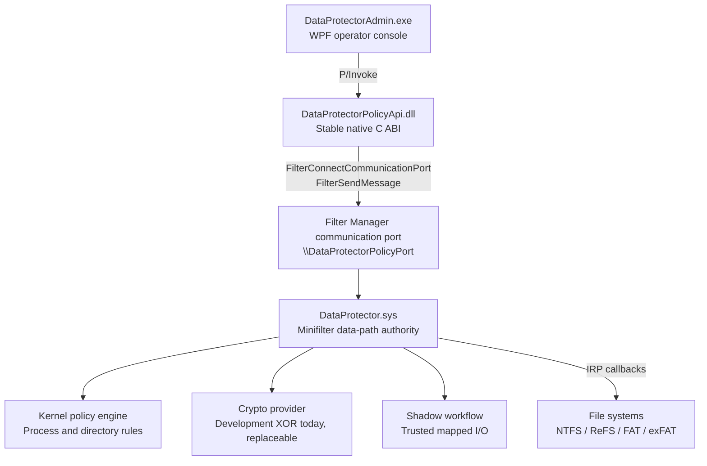

The admin application is not on the file data path. It configures policy. The
driver decides whether each file operation sees plaintext, ciphertext, logical
metadata, or raw physical metadata.

### 5.2 Data-Path Architecture

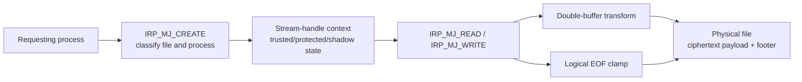

### 5.3 Control-Plane Architecture

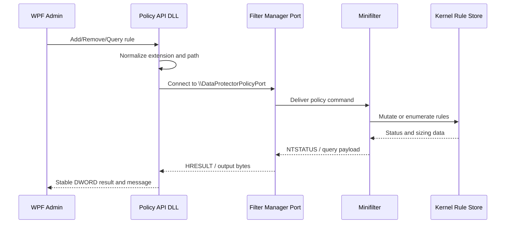

## 6. Formal Model

### 6.1 File Representation

Let `F` be a protected physical file:

```text
F = C || M
```

Where:

- `C` is the encrypted payload.
- `M` is the 512-byte DataProtector footer.
- `PhysicalSize(F) = |C| + 512`.
- `LogicalSize(F) = |C|`.

The driver exposes the following read views:

```text
View(process, F) =
    Decrypt(C)  if process is trusted for F.extension
    C           otherwise
```

The footer `M` is never part of the normal logical view.

### 6.2 Trust Predicate

For a requestor process `P` and file path `N`:

```text
Trusted(P, N) =
    ProtectedExtension(N)
    AND NOT Excluded(N)
    AND (
        ImageNameRule(P.image_name, Extension(N))
        OR ImageDirectoryRule(P.image_directory, Extension(N))
    )
```

An excluded directory has priority over protection:

```text
Excluded(N) => no encryption, no decryption, no footer semantics
```

### 6.3 Offset Mapping

Because metadata is stored at the end of the file, caller offsets remain stable:

```text
Application offset A -> physical payload offset A
```

Only read length and file-size information need adjustment:

```text
VisibleReadLength = min(RequestedLength, LogicalSize - RequestedOffset)
VisibleFileSize   = LogicalSize
PhysicalFileSize  = LogicalSize + 512
```

This is one of the main reasons the project uses a footer instead of a header.

## 7. Protected File Format

### 7.1 Physical Layout

```text
+-------------------------------+-------------------------------+
| Encrypted payload              | DataProtector footer          |
| Offset 0..LogicalSize-1        | Final 512 bytes of stream     |
+-------------------------------+-------------------------------+
```

The footer is part of the main stream so it moves with the file. Normal
applications should not see it because the driver virtualizes file size and
clamps reads.

### 7.2 Footer Structure

The current footer is defined by `DP_PROTECTION_FOOTER` and is packed to exactly
512 bytes.

| Field | Size | Purpose |
| --- | ---: | --- |
| `Magic` | 4 bytes | Identifies a DataProtector protected file |
| `Version` | 4 bytes | Footer format version |
| `FooterSize` | 4 bytes | Must equal 512 |
| `Flags` | 4 bytes | Reserved feature flags |
| `LogicalSize` | 8 bytes | Payload size visible to applications |
| `KeyLength` | 4 bytes | Number of valid bytes in `FileKey` |
| `FileKey` | 32 bytes | File key material for the transform provider |
| `Checksum` | 4 bytes | Footer integrity check for accidental mismatch |
| `Reserved` | 448 bytes | Forward-compatible format expansion |

Important constants:

```c
#define DP_PROTECTION_MAGIC 0x32465044u
#define DP_PROTECTION_FOOTER_SIZE 512
#define DP_PROTECTION_FOOTER_VERSION 1
#define DP_FILE_KEY_LENGTH 32
```

### 7.3 Footer Validation

A file is treated as protected only if all footer checks pass:

- Physical size is at least 512 bytes.
- `Magic` matches DataProtector.
- `Version` matches the supported footer version.
- `FooterSize` equals 512.
- `KeyLength` is nonzero and not larger than 32.
- `Checksum` matches the footer contents.
- `LogicalSize == PhysicalSize - 512`.

If validation fails, the file is treated as an ordinary file. This fail-open
classification is important for compatibility: random files with matching
extensions must not be corrupted by accidental metadata interpretation.

### 7.4 Why a Footer Is Used

Header metadata has a tempting property: it is easy to find. However, it forces
the filter to translate every application offset:

```text
Application offset A -> physical offset A + HeaderSize
```

That translation is dangerous for random access, memory mapping, structured
archives, and applications that compare file offsets with file sizes.

The footer design keeps payload offsets unchanged:

```text
Application offset A -> physical offset A
```

The driver only needs to virtualize EOF and metadata queries.

## 8. Policy Model

### 8.1 Rule Kinds

| Rule kind | Scope | Effect |
| --- | --- | --- |
| Process name | `process.exe + extension` | Trust matching executable name |
| Process directory | `directory + extension` | Trust executables under directory |
| Excluded directory | `directory + extension` | Disable protection under directory |

Rules are extension-bound. The same process can be trusted for `.dpf` and not
trusted for `.pptx`.

Example policy:

```text
notepad.exe                      + .dpf  -> trusted
C:\Program Files\WPS Office\     + .pptx -> trusted
D:\Exchange\PlainExports\        + .pptx -> excluded
```

### 8.2 Rule Priority

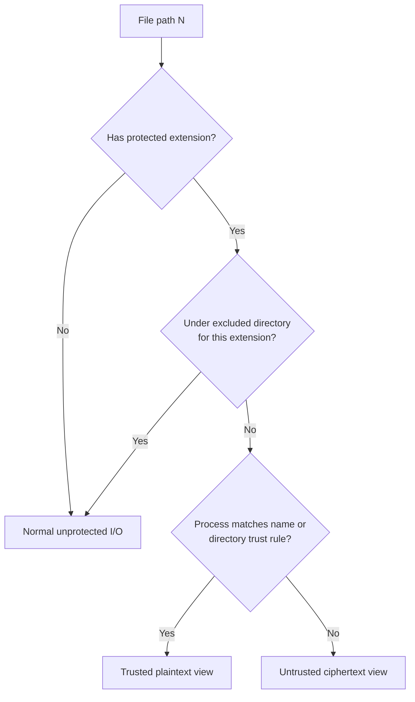

### 8.3 Path Normalization

The user-mode policy API accepts friendly DOS paths for directory rules and
converts them to NT device paths before sending them to the driver. This avoids
mixing user-mode drive letters with kernel file names.

The native API also normalizes extensions:

```text
"dpf"  -> ".dpf"
".DPF" -> ".DPF" as a normalized extension string for the rule channel
```

The kernel side performs case-insensitive matching.

### 8.4 Queryable Rule Store

The policy channel supports querying all rules. The query protocol reports:

- Rule count.
- Required buffer size.
- Returned buffer size.
- Variable-length entries containing rule type, value, and extension.

This matters for a real admin application. The UI must not only push commands;
it must be able to reconstruct the driver's current state.

## 9. Kernel State Model

### 9.1 Stream Context

The stream context stores file-level facts:

| Field | Meaning |
| --- | --- |
| `IsProtected` | The stream has a valid footer |
| `PlaintextCacheEnabled` | Diagnostic cache mode flag |
| `LogicalSize` | Application-visible payload size |
| `FileKeyLength` | Length of key material |
| `FileKey` | File key bytes copied from footer/provider |

Stream contexts are shared across opens of the same stream.

### 9.2 Stream-Handle Context

The handle context stores per-open decisions:

| Field | Meaning |
| --- | --- |
| `IsProtected` | This handle targets protected content |
| `IsTrusted` | This requestor is trusted for this file extension |
| `IsShadow` | This handle has been redirected to shadow content |
| `ShadowDirty` | Shadow must be written back on cleanup |
| `EncryptOnCleanup` | New or renamed file must be finalized |
| `FooterDirty` | Footer must be refreshed |
| `LogicalSize` | Stable logical size for this handle |
| `FileKey` | Key material used by this handle |
| `OriginalName` | Original protected stream path |
| `ShadowName` | Shadow stream path |
| `PendingName` | Rename destination captured before completion |

This split is essential. One file can be opened at the same time by a trusted
editor and an untrusted command-line process. They must not share one trust
decision.

## 10. End-to-End Workflows

### 10.1 Admin Rule Update Workflow

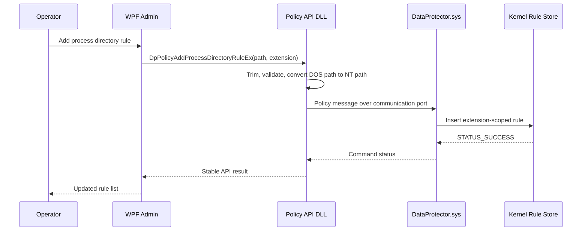

### 10.2 Trusted New File Creation

This workflow is used when a trusted process creates or overwrites a protected
extension.

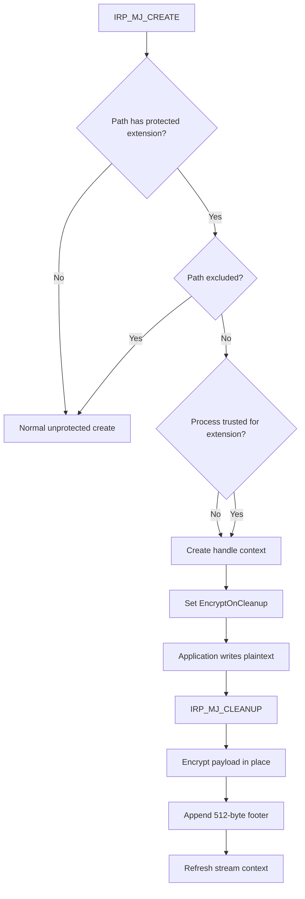

Rationale: many applications do not write final bytes immediately. Deferring
initial encryption until cleanup allows the application to complete its normal
save protocol first.

### 10.3 Trusted Open of an Existing Protected File

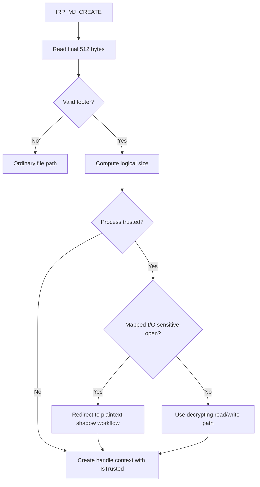

A trusted caller receives plaintext. The original physical file remains
ciphertext plus footer.

### 10.4 Untrusted Open of an Existing Protected File

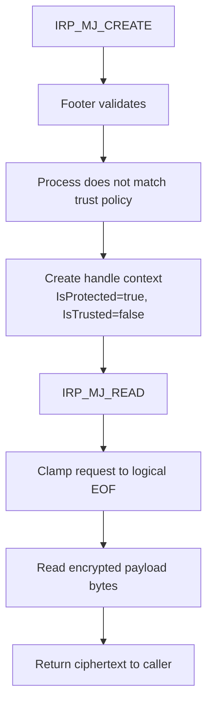

The untrusted process is not blocked. It receives the representation it is
allowed to see.

### 10.5 Read Path

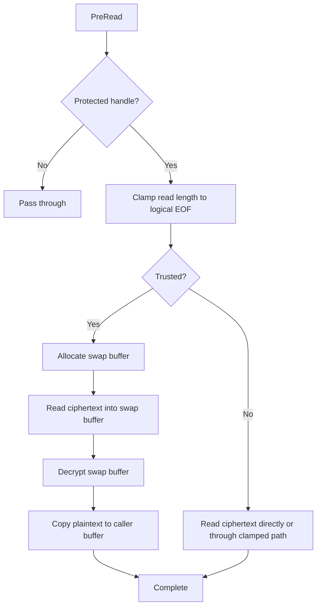

### 10.6 Write Path

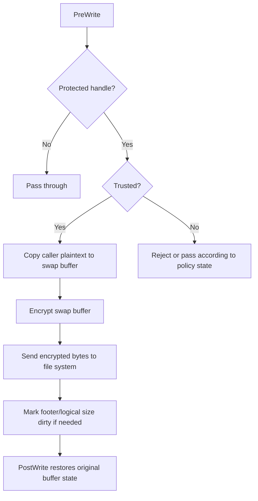

The exact behavior depends on whether the handle is an existing protected
stream, a newly created stream that will be encrypted on cleanup, or a shadow
handle.

### 10.7 Query Information and Directory Enumeration

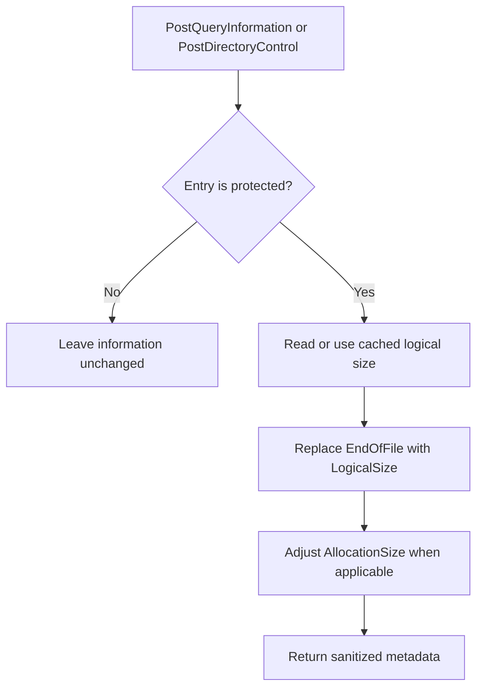

This is required because a protected file is physically 512 bytes larger than
the payload visible to applications.

### 10.8 Rename-to-Protected Workflow

Commercial document editors frequently use this pattern:

```text
create temporary file -> write content -> rename temporary file to final name
```

DataProtector treats the destination name as the protection decision point.

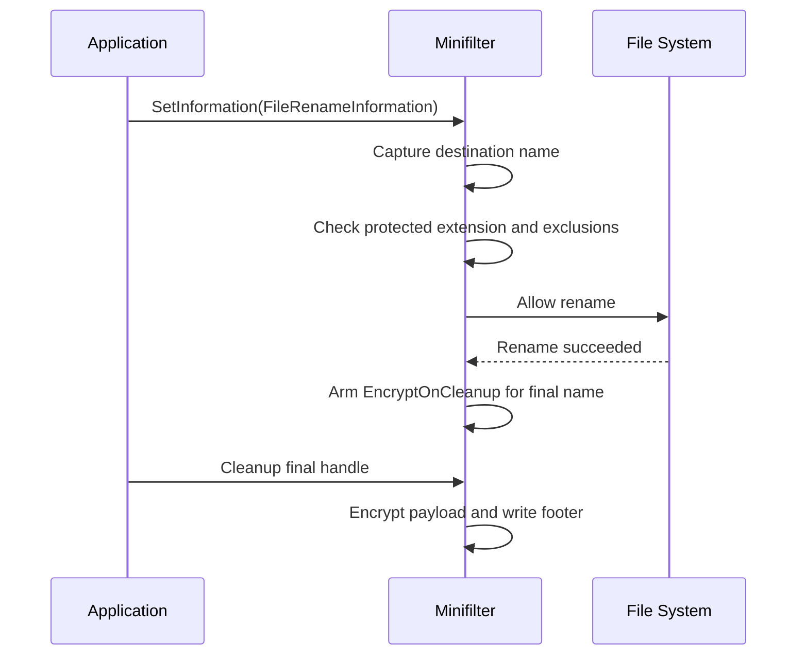

Without this workflow, `.pptx`, `.docx`, and similar formats may remain
plaintext because the original write happened under a temporary extension.

### 10.9 Excluded Directory Workflow

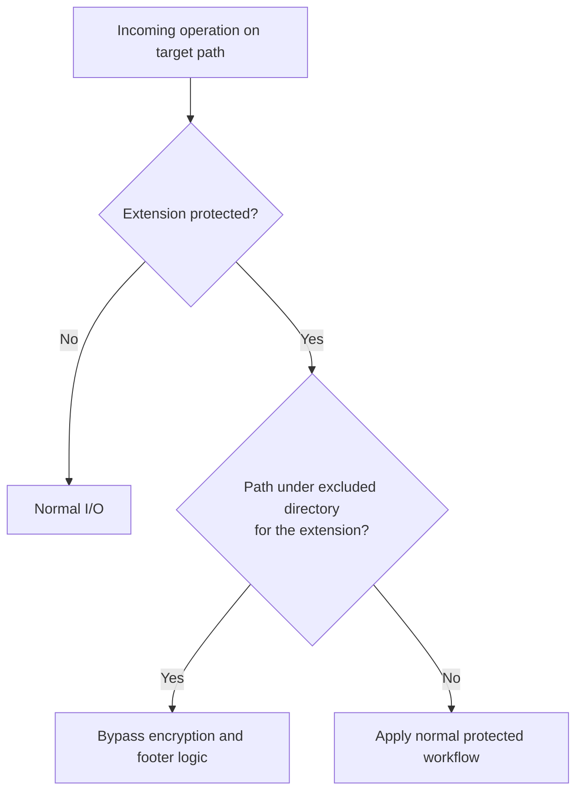

Exclusions are important for staging directories, export folders, compatibility
folders, and application caches.

### 10.10 Trusted Mapped-I/O Shadow Workflow

Some editors use memory-mapped files and Cache Manager paths. If plaintext is
allowed into the original file cache, an untrusted process can later observe it
through another open. DataProtector avoids that design by using a shadow view
for trusted mapped workflows.

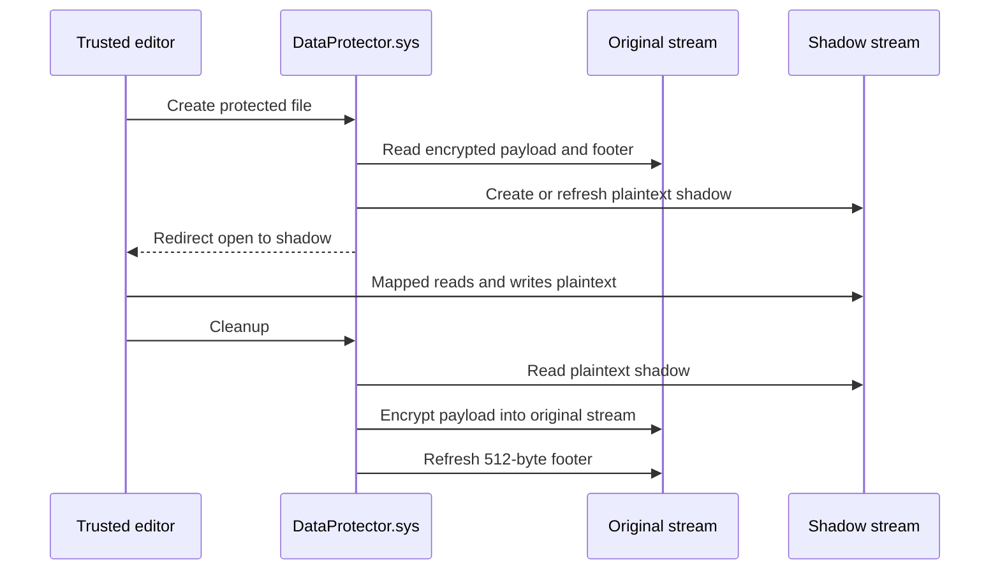

Current implementation note: the shadow workflow uses an internal
`:DataProtectorShadow` stream for compatibility. Persistent protection metadata
does not use ADS; it uses the 512-byte footer. Removing the shadow ADS is a
future hardening task if a strict zero-ADS product requirement is adopted.

### 10.11 Driver Stop and Raw File Observation

When the driver is stopped, the file system no longer virtualizes reads, sizes,
or the footer. A protected file should appear as raw ciphertext payload plus
footer.

```text
driver running:
  trusted process   -> plaintext logical bytes
  untrusted process -> ciphertext logical bytes

driver stopped:
  any process       -> physical bytes on disk
                       ciphertext payload + footer
```

This is expected for transparent encryption. If the driver is stopped and a
file is still readable as plaintext, the file was not protected or was saved
outside the protected workflow.

## 11. Kernel Callback Design

The driver registers the following major operations:

| Operation | Purpose |
| --- | --- |
| `IRP_MJ_CREATE` | Classify protected files, trust, shadow redirection |
| `IRP_MJ_READ` | Clamp logical EOF, decrypt for trusted callers |
| `IRP_MJ_WRITE` | Encrypt trusted writes or mark deferred encryption state |
| `IRP_MJ_SET_INFORMATION` | Detect rename, EOF, allocation changes |
| `IRP_MJ_QUERY_INFORMATION` | Virtualize logical file size |
| `IRP_MJ_DIRECTORY_CONTROL` | Virtualize directory entry sizes |
| `IRP_MJ_CLEANUP` | Finalize deferred encryption and shadow writeback |
| `IRP_MJ_ACQUIRE_FOR_SECTION_SYNCHRONIZATION` | Protect mapped-I/O behavior |
| `IRP_MJ_FAST_IO_CHECK_IF_POSSIBLE` | Control fast I/O compatibility |

The callbacks work together. No single callback is sufficient to implement
transparent encryption correctly.

## 12. Algorithms

### 12.1 Footer Validation

```text
ValidateFooter(file):
    physicalSize = QueryPhysicalSize(file)
    if physicalSize < 512:
        return NotProtected

    footer = Read(file, physicalSize - 512, 512)

    if footer.Magic != DP_PROTECTION_MAGIC:
        return NotProtected
    if footer.Version != DP_PROTECTION_FOOTER_VERSION:
        return NotProtected
    if footer.FooterSize != 512:
        return NotProtected
    if footer.KeyLength == 0 or footer.KeyLength > 32:
        return NotProtected
    if footer.Checksum != Checksum(footer):
        return NotProtected
    if footer.LogicalSize != physicalSize - 512:
        return NotProtected

    return Protected(footer)
```

### 12.2 Create Classification

```text
PreCreate(request):
    name = NormalizeFileName(request)

    if IsInternalDataProtectorIo(request):
        pass through

    if IsShadowName(name):
        allow only trusted shadow workflow

    if not HasProtectedExtension(name):
        pass through

    if IsExcluded(name):
        pass through

    protected = HasValidFooter(name)
    trusted = IsProcessTrusted(request.Process, name.Extension)

    if protected and trusted and RequiresShadow(request):
        redirect to shadow workflow

    create per-handle context:
        IsProtected = protected or should protect on cleanup
        IsTrusted = trusted
        LogicalSize = footer.LogicalSize if protected
```

### 12.3 Trusted Read

```text
TrustedRead(handle, offset, length):
    if offset >= LogicalSize:
        return EOF

    visibleLength = min(length, LogicalSize - offset)
    cipher = ReadPhysical(handle, offset, visibleLength)
    plain = Transform(cipher, key, offset)
    return plain
```

### 12.4 Untrusted Read

```text
UntrustedRead(handle, offset, length):
    if offset >= LogicalSize:
        return EOF

    visibleLength = min(length, LogicalSize - offset)
    cipher = ReadPhysical(handle, offset, visibleLength)
    return cipher
```

### 12.5 Deferred Encryption on Cleanup

```text
Cleanup(handle):
    if handle.IsShadow and handle.ShadowDirty:
        EncryptShadowBackToOriginal(handle)
        RefreshFooter(handle.OriginalName)
        return

    if handle.EncryptOnCleanup:
        logicalSize = QueryCurrentPayloadSize(handle)
        EncryptPayloadInPlace(handle, 0, logicalSize)
        AppendOrRefreshFooter(handle, logicalSize)
        RefreshStreamContext(handle)
```

### 12.6 Rule Query Sizing

```text
QueryRules(outputBuffer):
    required = sizeof(QueryHeader)

    for each rule:
        required += sizeof(QueryEntryHeader)
        required += rule.ValueLengthBytes
        required += rule.ExtensionLengthBytes

    if outputBuffer is header-only:
        return required size and rule count

    if outputBuffer is too small:
        return STATUS_BUFFER_TOO_SMALL with required size

    serialize all rules into caller buffer
```

This two-pass shape allows the admin app to allocate a correctly sized buffer.

## 13. User-Mode Policy API

`DataProtectorPolicyApi.dll` exposes a C ABI that can be consumed by WPF,
command-line tools, installers, services, or tests.

Representative functions:

```c
DWORD DpPolicyCheckConnection(void);

DWORD DpPolicyAddProcessNameRuleEx(
    LPCWSTR processName,
    LPCWSTR extension);

DWORD DpPolicyAddProcessDirectoryRuleEx(
    LPCWSTR directoryPath,
    LPCWSTR extension);

DWORD DpPolicyAddExcludedDirectoryRuleEx(
    LPCWSTR directoryPath,
    LPCWSTR extension);

DWORD DpPolicyQueryProcessRules(
    DP_POLICY_API_RULE *rules,
    DWORD ruleCapacity,
    DWORD *ruleCount,
    LPWSTR stringBuffer,
    DWORD stringBufferChars,
    DWORD *stringBufferCharsRequired);

DWORD DpPolicyGetLastErrorMessage(
    LPWSTR buffer,
    DWORD bufferChars);
```

The API is responsible for:

- Validating arguments.
- Normalizing extensions.
- Converting DOS directory paths to NT paths.
- Connecting to the driver port.
- Returning stable application-level error codes.
- Preserving a human-readable last error message.

## 14. Administration Application

`DataProtectorAdmin` is a WPF application using the `wpf-ui` package. Its role
is policy administration, not file data transformation.

Expected capabilities:

- Driver connection status.
- Process-name trust rules.
- Process-directory trust rules.
- Excluded-directory rules.
- Extension-bound rule editing.
- Query and refresh rules from the driver.
- Tray icon and application icon integration.
- Local UI settings.
- Clean error reporting when the driver is not loaded.

The admin app follows this separation:

```text
View/XAML -> ViewModel -> Policy service -> Native P/Invoke -> Policy API DLL -> Driver
```

The UI must never invent a rule state that the driver has not confirmed. The
driver is the source of truth.

## 15. Build and Packaging

### 15.1 Requirements

Recommended build environment:

- Windows 10 or Windows 11 x64.
- Visual Studio 2019.
- Windows Driver Kit compatible with Visual Studio 2019.
- .NET Framework 4.7.2 or newer for the WPF admin app.
- Administrator privileges for driver installation and service control.
- Test-signing or a valid driver signing pipeline.

The scripts currently expect MSBuild at:

```text
D:\Program Files (x86)\Microsoft Visual Studio\2019\Enterprise\MSBuild\Current\Bin\amd64\MSBuild.exe
```

Adjust the scripts if Visual Studio is installed elsewhere.

### 15.2 Build Solution

```powershell
.\Build-All.ps1 -Configuration Release -Platform x64
```

Equivalent direct command:

```powershell
& 'D:\Program Files (x86)\Microsoft Visual Studio\2019\Enterprise\MSBuild\Current\Bin\amd64\MSBuild.exe' `
  .\DataProtector.sln `
  /p:Configuration=Release `
  /p:Platform=x64 `
  /m
```

Expected outputs:

```text
x64\Release\DataProtector.sys
x64\Release\DataProtector\dataprotector.cat
DataProtectorPolicyApi\x64\Release\DataProtectorPolicyApi.dll
DataProtectorAdmin\bin\x64\Release\DataProtectorAdmin.exe
```

### 15.3 Publish Admin Package

```powershell
.\Publish-Admin.ps1
```

Default output:

```text
publish\DataProtectorAdmin-x64-Release\
```

The package must include:

```text
DataProtectorAdmin.exe
DataProtectorAdmin.exe.config
DataProtectorPolicyApi.dll
Wpf.Ui.dll
```

### 15.4 Publish Central Web Package

```powershell
.\Publish-WebAdmin.ps1
```

Default output:

```text
publish\DataProtectorWebAdmin-x64-Release\
```

The package contains two runtime roles:

```text
server\DataProtectorWebBridge.exe   Central server and Web UI host
server\web\                         Built SoybeanAdmin static assets
agent\DataProtectorWebBridge.exe    Endpoint polling agent
agent\DataProtectorPolicyApi.dll    Native driver policy API for the agent
```

## 16. Installation and Runtime

### 16.1 Test Environment

Kernel minifilter development should be tested in a VM or dedicated test
machine. A driver bug can crash the system.

### 16.2 Driver Service Control

Typical commands after installing the INF package:

```cmd
sc query DataProtector
net start DataProtector
net stop DataProtector
fltmc filters
```

Manual unload is currently enabled for development convenience. Production
builds need a safe-stop design that flushes, synchronizes, and prevents
plaintext cache exposure before unload.

### 16.3 Central Server and Agent Runtime

On the management server:

```cmd
cd /d publish\DataProtectorWebAdmin-x64-Release\server
netsh http add urlacl url=http://+:17643/ user=%USERNAME%
netsh advfirewall firewall add rule name="DataProtector Central Server" dir=in action=allow protocol=TCP localport=17643
DataProtectorWebBridge.exe server
```

Open the console from an administrator workstation:

```text
http://<server-ip>:17643/
```

On every protected endpoint, install and start the minifilter driver, then run
the agent:

```cmd
cd /d publish\DataProtectorWebAdmin-x64-Release\agent
DataProtectorWebBridge.exe agent http://<server-ip>:17643/ 15
```

The agent actively polls the central server through `/api/agent/sync`, registers
the device, pulls the current policy version, clears local driver rules, applies
the central rules, and reports the last apply result. Client machines do not
need inbound firewall rules for management.

Central server state is stored here:

```text
C:\ProgramData\DataProtector\CentralState.json
```

For single-machine debugging, the legacy local bridge remains available:

```cmd
DataProtectorWebBridge.exe standalone
```

### 16.4 Basic Runtime Test

Example:

```text
1. Start DataProtector.
2. Add a trusted process rule for notepad.exe + .dpf.
3. Create test.dpf from Notepad.
4. Close Notepad so cleanup finalizes encryption.
5. Reopen test.dpf with Notepad.
   Expected: plaintext.
6. Read test.dpf from an untrusted tool.
   Expected: ciphertext.
7. Stop DataProtector and read the physical file.
   Expected: ciphertext payload plus private footer bytes.
```

## 17. Validation Matrix

| Area | Scenario | Expected result |
| --- | --- | --- |
| Creation | Trusted process creates `.dpf` | File is encrypted on cleanup |
| Creation | Unprotected extension is created | No footer is written |
| Existing read | Trusted process reads protected file | Plaintext logical bytes |
| Existing read | Untrusted process reads protected file | Ciphertext logical bytes |
| EOF | Read crosses logical EOF | Read is shortened before footer |
| EOF | Read starts at logical EOF | EOF or zero payload |
| File info | `dir` lists protected file | Logical size, not physical size |
| File info | Explorer properties | Logical size where filtered |
| Portability | Protected file is moved | Footer travels with file |
| Portability | Trusted process opens moved file | File is recognized and decrypted |
| Driver stopped | Raw read of protected file | Ciphertext and footer are visible |
| Rename | Temporary file renamed to `.pptx` | Protection applied after cleanup |
| Exclusion | `.pptx` under excluded directory | File remains ordinary plaintext |
| Policy | Add process-name rule | Driver query returns the rule |
| Policy | Remove process-directory rule | Driver query no longer returns it |
| Mapped I/O | Trusted Office-style editor opens file | Shadow workflow protects original cache |
| Admin | Admin starts without driver | UI reports connection failure cleanly |

## 18. Diagnostics

### 18.1 Driver Does Not Start

Check:

- Driver signing state.
- INF installation result.
- Minifilter altitude conflicts.
- Event Viewer system logs.
- `sc query DataProtector`.
- `fltmc filters`.

### 18.2 Admin Cannot Connect

Check:

- `DataProtector.sys` is loaded.
- `\DataProtectorPolicyPort` is available.
- `DataProtectorPolicyApi.dll` is beside the admin executable.
- The admin process is x64.
- The process has sufficient privileges.

### 18.3 Trusted Application Still Reads Ciphertext

Check:

- The process-name rule matches the real executable name.
- The process-directory rule matches the actual NT image path.
- The extension in the rule matches the file extension.
- The target path is not excluded.
- The file has a valid footer.
- The application is not opening a temporary file path outside the rule.

### 18.4 File Size Is 512 Bytes Too Large

Check:

- The newest driver build is loaded.
- Query information callbacks are registered.
- Directory enumeration is passing through the filter.
- The footer validates successfully.

### 18.5 PPTX and Office-Style Save Investigation

The driver contains a targeted compile-time tracing switch:

```c
#define DP_ENABLE_PPTX_OPERATION_TRACE 1
```

This switch emits `DbgPrintEx` lines for `.pptx` paths and DataProtector
internal streams. It should be disabled for normal builds after compatibility
investigation.

Useful tools:

- WinDbg kernel debugging.
- DebugView or kernel debug output capture.
- Process Monitor with file-system events.
- Driver Verifier profiles for minifilter stress testing.

## 19. Current Limitations

The project is not yet a finished commercial security product. Current
limitations include:

- The crypto provider is a development XOR transform.
- The file key field exists, but there is no production key hierarchy.
- There is no authenticated encryption or tamper-proof footer validation.
- Policy persistence and policy authorization are not hardened.
- Test trusted processes may be compiled in for local bring-up.
- Manual unload is enabled for development.
- The mapped-I/O shadow workflow currently uses an internal alternate stream.
- Automated kernel integration tests are not yet included.
- Crash-consistency recovery for interrupted cleanup encryption needs a
  production journal or transactional design.
- Installer, upgrade, rollback, and fleet management workflows are not complete.

## 20. Production Hardening Roadmap

Recommended milestones:

1. Replace the XOR provider with authenticated encryption.
2. Introduce per-file data keys wrapped by a machine, user, or enterprise key.
3. Add footer authentication, anti-rollback metadata, and version migration.
4. Persist policy in a protected store with integrity validation.
5. Move trust decisions to a signed policy service.
6. Remove development default trusted process rules.
7. Design a safe-stop protocol for unload and service upgrades.
8. Add crash-consistent encryption finalization.
9. Add stress tests for concurrent open, rename, overwrite, truncation, and
   memory mapping.
10. Add compatibility suites for WPS, Office, Notepad, Explorer, copy tools,
    backup tools, and archive tools.
11. Replace or redesign the shadow storage mechanism if strict zero-ADS
    operation is required.
12. Add CI validation for the driver, policy DLL, WPF package, and installer.
13. Add signed release packaging and certificate management.
14. Add telemetry-free local diagnostics suitable for enterprise support.

## 21. Engineering Principles

DataProtector follows these engineering principles:

- Keep the data path in the driver and policy configuration in user mode.
- Keep process trust decisions per handle, not globally per file.
- Keep persistent metadata portable inside the main stream.
- Keep private metadata invisible to normal logical file operations.
- Treat rename, temporary files, and mapped I/O as first-class workflows.
- Prefer replaceable modules over hard-coded product assumptions.
- Document development switches clearly.
- Avoid production-security claims until crypto, keys, policy, installer, and
  self-protection are hardened.

## 22. Status

The maintained development environment builds `Release|x64` with Visual Studio
2019 and the Windows Driver Kit.

The latest implemented storage model uses a fixed 512-byte footer in the main
file stream. This makes protected files portable while preserving normal
application offsets. Trusted processes receive decrypted logical content.
Untrusted processes receive ciphertext logical content. The driver hides the
footer through read clamping, file information virtualization, and directory
enumeration adjustment.

The codebase should be treated as a serious transparent-encryption prototype
with a commercial architecture direction, not as a completed production
security product.
